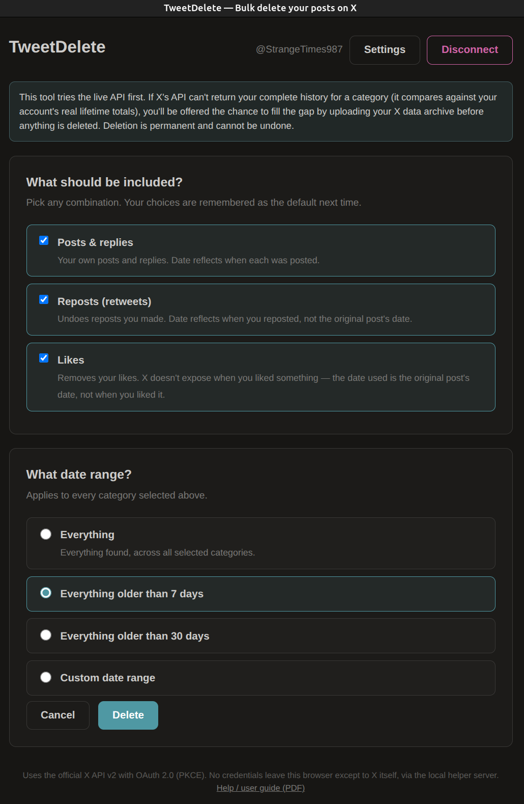

# TweetDelete / XTweetDelete

*I call the app TweetDelete but there is another web based service called https://tweetdelete.net/ that has registered the name on X. Hence you may see XTweetDelete used for this desktop app in places to avoid namespace conflicts, e.g., X’s developer console and authorisation process. It hasn't been extensively tested other than I use it and it has worked without issue*

  

## What does TweetDelete do?

TweetDelete will delete your posts, replies, likes & reposts from X in bulk. For a small number of Tweets, it will do this without manual assistance but X has limits including rate limiting. If you have many thousands of tweets it will delete as many as it can up to the search limit that X allows. It will then stop and ask you to download an archive file of the tweets from X and provide it with that to find the others and delete them. This is a limitation imposed by X, it may change with time, at the time of writing the limit was 3,200 before an archive is required manually. 
If you have a small number of tweets, say <50, it should do that pretty quickly in just a second or two. As you have more it will take longer as X limits the rate of access. Currently to 50 at a time.

I found that to delete very old likes requires the archive download. Not sure if this is an X thing or TweetDelete.

## Why would I need this?

Deleting tweets on X is a laborious, one at a time process. This automates it.
You might wonder why you would want to do this. We are seeing increasing surveillance and restriction on free speech. Tweets are taken out of context; police action is taken based on claimed offence. Let’s face it someone, somewhere is always going to claim offence at other’s opinions. We also all grow and change and for personalities & politicians the media regularly rakes up old tweets in order to embarrass, mislead and even destroy careers. It is not uncommon to say something stupid and rash in an emotional state or from lack of maturity when young.

## How do you use it?

> **!NOTE**
>  You need an X developer account in order to obtain a client id as a credential for the app to operate:  https://docs.x.com/fundamentals/developer-portal

The X developer account is free. It may seem complex and confusing if you are not an IT Geek, in which case I suggest you ask your friendly AI to walk you through the process. What is not free, is using the X api. Unfortunately, X charge for all API / automated access. 

It is not expensive for most people, the price at time of writing is $0.005 per deletion but this can change. Suggest you pay a small amount and see how much is taken. The process will stop if you exceed the amount paid. 

Armed with a client id, install TweetDelete for your system, it'll ask for the client id when it starts, normally once only unless you clear browser cache etc.

During installation 2 things will be done; a tiny server component, which is more of a proxy for the comms to X, will be installed and a Javascript app that runs in the browser.

Launch the app from the menu system or terminal; “tweetdelete”. It will launch and run in your default browser.

### Warning!

Once you tell TweetDelete to delete, it will try quite hard. If you close it the browser, the helper app will try to continue in the background. The browser is just the interface. If you stop the helper app, it will resume when it restarts, if you restart the PC, it will resume. To be sure of halting a run you need to kill the helper app and stop it from being restarted at next boot. To stop it forever delete the app & reinstall. At some point I will add the capability to easily halt but it's not something that should be needed really.

A simpler and faster way to change your mind mid run will be added later.

## Operating System

Currently I have built TweetDelete for 3 platforms; Windows 64 bit, Debian derived Linux & Android. The Windows version worked on my Intel  based Windows 11, it ought to run on other recent Windows options but has not been tested.  It uses Python (packaged) and Javascript.  The Debian version works on my Ubuntu 24.04 desktop and should run on most Debian based platforms that have Python >= v3.8  installed which is likely all of them.

## Security

Security of client id has not been considered to any depth, it is assumed this will be used on a personal device which has the level of security the user is comfortable with. If your device is compromised you may be exposed. "If" you are a high profile personality or their staff, you may want to use this on a hardened device. To be extreme a hostile state who has fully hacked your device could assume your X identity. You'd also have other problems in that case!

- **No client secret.** The app uses OAuth 2.0 with PKCE as a "public client", so no secret is ever used or saved (`oauth.js`).

- **Client ID and redirect URI.** Saved under the key `td_client_config`. These aren't secret.

- **Access and refresh tokens.** Saved under the key `td_tokens`. These are what matter: with `offline.access` in the scopes, anyone holding the refresh token can keep deleting, posting and liking on your account until you revoke it.

- **PKCE verifier and state.** Kept only for the duration of the login (`sessionStorage`) and removed once the token exchange finishes.

## Credits

Thanks to Perplexity AI which did the coding. I don’t know which models it used; it was set to auto select but was mostly Claude Opus 5.5. I was impressed, it was producing the executables in approx. 5 minutes per iteration. The longest time was spent on sorting out the packaging and installation process which took a day or two of iteration, mainly because the agent couldn't test Windows and relied on my slowness.

## Licencing

Copyright © 2026 Ian Packer.

Licensed under [PolyForm Non-commercial License 1.0.0]()

Commercial use requires a separate licence from the copyright holder.

This software is provided free of charge; that might change one day but I have no plans currently. It is free to use by individuals. It will not (probably can’t be) retrospectively charged if it was used in compliance with this licencing approach.

It is supplied without any warranty, guarantees or support. If you find a bug by all means email to the address below. Note: This is not my job I produced it for my own use and I am simply sharing, the risk is yours. It has not been professionally tested.

It is not licenced for use in commercial gain. If you wish to discuss such use, 
please email: think-1551@pm.me

## Installation

### Windows 11, 64 bit x86

It may work on other releases, maybe even ARM, I haven't tried. 
Download TweetDelete-Setup.exe and run it. It installs to; %LOCALAPPDATA%\Programs\TweetDelete of the user installing. You will get a warning from Windows because I haven't signed up for Microsoft's code-signing certificate subscription. 

You 'may' get anti-virus warnings, usually not.

It should be setup as any other Windows user app. There is a small server/proxy running and will show up on the system tray. This is needed due to X.com API and CORS protections. The app runs in the browser talking via the server/proxy.

[DOWNLOAD for Windows   ]()

### Debian / Ubuntu

It has only been tested on Ubuntu 24.04 but should run on other Debian architecture Linux. On this version it is dependent on the presence of Python 3.8 or later. It should pull it in if not present.

Download the .deb package and run with:
`sudo apt install ./tweetdelete_1.0.0_all.deb`

It installs a small systemd server component, which should be started and will start whenever you login, it is called "tweetdelete.service". This is a proxy service for X.com to avoid CORS protections.

The app will install menu items and start in the default browser.

[DOWNLOAD for Debian / Ubuntu   ](https://github.com/user-attachments/files/31076055/tweetdelete_1.0.0_all.zip)
